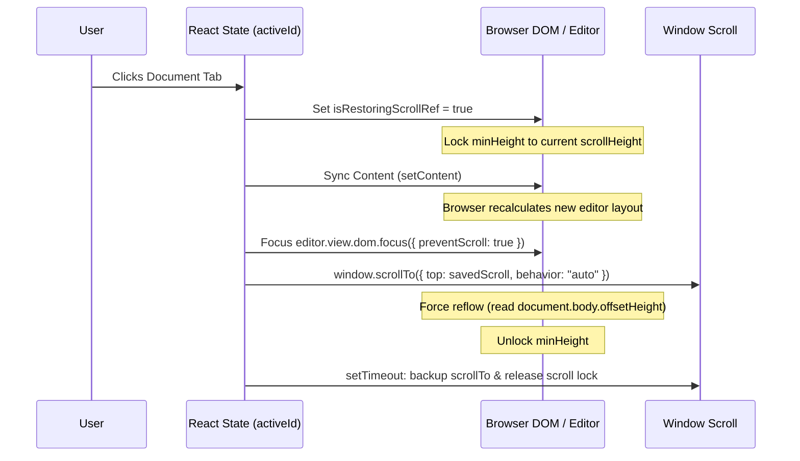

# Architecture & UX Design Plan: Bulletproof Tab-Switch Scroll Restoration

## 1. Product & UX Analysis (The $100B Valuation Standard)
When platforms like **Notion**, **VS Code**, and **Google Docs** handle document switching, they prioritize a **zero-layout-shift** policy. Any visual jump, stutter, or scroll-to-top frame is considered a severe product defect.

### The Underlying Browser Mechanics
1. **Layout Collapse:** When document content changes, the editor's DOM elements are torn down. The browser calculates the height of the document as `0` or near `0`. 
2. **Scroll Clamping:** Since the document height collapses, the browser automatically clamps `window.scrollY` to the maximum available height (which is `0`).
3. **Focus Jump:** When focusing a contenteditable element, the browser natively executes a "scroll-into-view" routine to align the viewport with the text insertion caret, which defaults to the top.
4. **Race Conditions:** Deferred scroll restoration (`setTimeout`) executes *after* the browser has already painted the page at `0`, resulting in a visible "flash-to-top" before snapping back down.

---

## 2. Recommendation & Strategy Comparison

| Strategy | Technical Approach | UX Impact | Implementation Risk | Recommendation |
| :--- | :--- | :--- | :--- | :--- |
| **Strategy A: DOM Isolation (Multi-Editor)** | Mount a separate editor DOM node per tab, toggling visibility via `display: none`. | Perfect (Preserves undo stack, selections, and native scroll positions). | High (Requires massive refactoring of global toolbar hooks and state bindings). | Long-term target. |
| **Strategy B: Synchronous Height-Locking & PreventScroll Focus** | Lock container dimensions, update content, focus with `preventScroll`, and scroll synchronously before paint. | Near-Perfect (Zero visual jumping, instant snap, no layout flashes). | Low (Contained within `App.tsx` tab-switching hook). | **Recommended for Immediate Hardening.** |

---

## 3. The Bulletproof Strategy B Specification

To achieve the premium, instant tab-switching experience, we will implement the following safeguards:

### Key Engineering Details
1. **Height-Locking:** Set the editor container's `minHeight` temporarily to the maximum of the current page height and the target page height. This prevents the document scrollbar from collapsing to `0` during the content swap.
2. **PreventScroll Focus:** Use the native browser API `editor.view.dom.focus({ preventScroll: true })` to focus the editor element while explicitly blocking the browser from scrolling the viewport to the cursor.
3. **Force Reflow:** Trigger a synchronous layout pass by reading `document.body.offsetHeight` immediately after setting content. This ensures the browser computes the new document height *before* we apply the scroll restoration.
4. **Synchronous Scroll Snap:** Call `window.scrollTo` in the same synchronous execution block, guaranteeing the browser paints the very first frame at the correct scroll offset.
5. **Scroll Listener Shield:** Ensure `isRestoringScrollRef.current` remains `true` throughout the transition to prevent the scroll saver from recording intermediate scroll values.

---

## 4. Phased Implementation Plan

### Phase 1: Height Locking & Synchronous Sync
- **1.1:** Lock `editorWrap` min-height before swapping content.
- **1.2:** Call `setContent` and immediately trigger `document.body.offsetHeight` to force reflow.
- **1.3:** Execute `window.scrollTo` synchronously.
- **1.4:** Restore `min-height` to its original value.

### Phase 2: Focus Stabilization & Lock Release
- **2.1:** Focus using native `editor.view.dom.focus({ preventScroll: true })`.
- **2.2:** Set a short timeout (`50ms`) to allow layout paint to complete.
- **2.3:** Re-enforce `window.scrollTo` inside the timeout as a safety check, then release `isRestoringScrollRef.current = false`.

### Phase 3: Verification & Compilation
- **3.1:** Compile and packaging checks.
- **3.2:** Verify tab switching under large documents to ensure zero visual flashing.
